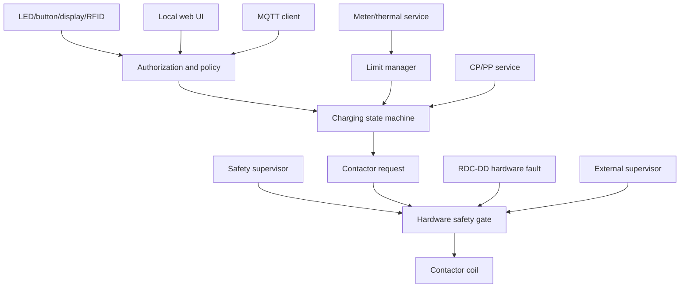

# Architecture and interface specification — revision 0.1

## 1. Frozen product decisions

| Topic | Decision |
|---|---|
| Electrical rating | 230 V AC, single phase, 32 A, 7.4 kW |
| Vehicle connection | Permanently attached cable with Type 2 plug |
| Installation systems | TN-S and TN-C-S, with separate L/N/PE supplied to the EVSE |
| Enclosures | IP20 development configuration; IP65 outdoor-target configuration |
| Mounting | Wall and pedestal |
| Environment | −25…+55 °C; maximum altitude 4000 m |
| Residual-current protection | Integrated RDC-DD function suitable for the selected conformity route |
| Upstream protection | External distribution-board MCB and Type A RCD |
| Controller | ESP32-S3 module, ESP-IDF |
| Base local UI | Status LEDs and one multifunction/service button |
| IP65 UI | Status LEDs, button, touch display, and RFID reader |
| Phone access | Responsive local web application initially |
| Wi-Fi modes | SoftAP commissioning plus station/client operation |
| Time | NTP-synchronized civil time; monotonic safety timing |
| Integration | MQTT telemetry and validated commands |

TN-C-S support means the installation presents separate L, N, and PE conductors after the upstream PEN separation point. The EVSE shall never contain a PEN link or use N as a substitute for PE.

The external C32 circuit breaker and Type A 40 A / 30 mA RCD are outside the EVSE design boundary. They shall not appear as fitted components in the EVSE schematic or BOM. The top-level schematic shall show only the L/N/PE installation interface and an off-sheet installation note. Fuses or protection dedicated solely to internal auxiliary circuits remain inside the EVSE where required.

## 2. Enclosure strategy

### IP20 development configuration

- Intended for a controlled laboratory/indoor prototype environment.
- Accessible service connectors may be fitted only where touch-safe separation is maintained.
- The high-voltage compartment remains covered and tool-accessible even though the outer development housing is IP20.
- It may expose USB/service interfaces and may carry the optional display during firmware development.

### IP65 outdoor-target configuration

- Sealed enclosure, glands, attached-cable entry, button, indicators, optional display/RFID window, and any pressure-equalization vent must form one tested ingress-protection system.
- Prefer an external-antenna ESP32-S3-WROOM-1U if the enclosure, display metallization, mounting surface, or internal power hardware materially shields a PCB antenna.
- If the PCB-antenna WROOM-1 is used, place its antenna at the enclosure/PCB edge with the Espressif keepout and validate RF performance in the complete enclosure.
- No field-accessible USB or unsealed service opening.
- Use condensation management, UV-rated materials, corrosion-resistant hardware, cable strain relief, and a drainage/orientation strategy.
- Validate both wall and pedestal installations, including gasket loading, cable pull, impact, anchoring, drainage, and antenna performance.

IP20 and IP65 are configuration targets, not labels that can be applied from component ratings alone. The assembled product needs the relevant enclosure and ingress tests.

The −25…+55 °C and 4000 m envelope is a demanding condition. Reduced air density affects cooling, and electrical clearances require altitude correction above 2000 m. Automatic current derating is explicitly permitted, so 32 A is available only inside the validated thermal envelope. The final rating label and manual shall state the applicable derating behavior.

## 3. Controller selection

Use **ESP32-S3-WROOM-1-N8R8** as the prototype baseline, subject to availability and schematic pin audit. Its flash/PSRAM combination provides margin for two OTA images, HTTPS, web assets, MQTT, logs, and an optional graphical display. Using a module reduces RF-design risk relative to a bare SoC.

For a difficult IP65 RF environment, use the **ESP32-S3-WROOM-1U** antenna variant and a suitable certified 2.4 GHz antenna/feedthrough. Final suffix and temperature grade must be checked against the current Espressif ordering table before procurement.

Controller design rules:

- Four-layer controller PCB preferred, with a continuous ground plane.
- Maintain the module antenna keepout; keep high-current, CP, coil, USB, and fast digital traces away from it.
- Keep the controller in SELV. All mains measurements and non-SELV external interfaces cross rated isolation/protection barriers.
- Use an external supervisor/safety gate; internal ESP32 watchdogs alone are not the final contactor enable.
- Reserve native USB for IP20 development; protect against ESD and restrict it in production.

## 4. Functional partitioning

| Block | Primary ESP32-S3 interface | Isolation/safety notes |
|---|---|---|
| CP generator | PWM/timer plus enable | Protected ±12 V analog domain; defined power-up behavior |
| CP measurement | ADC plus comparators/capture | Independent plausibility signals and input protection |
| PP measurement | ADC | Protected against connector ESD/shorts |
| RDC-DD | latched fault input, test output, optional diagnostics | Fault also directly disables the coil gate |
| Contactor driver | request plus retriggered safety enable | Defaults off; controlled coil transient path |
| Contactor feedback | isolated auxiliary and output-voltage sense | Diverse weld/failure observations |
| Energy meter | isolated UART/SPI or pulse outputs | Display-grade baseline; billing grade not claimed |
| Temperature | protected ADC channels | Power termination/contactor and PCB minimum |
| LEDs/button | GPIO/PWM and protected input | No shared safety-enable pins |
| Touch display | optional SPI plus I2C/SPI touch | SELV, keyed/protected daughterboard connector |
| RFID | optional SPI/I2C plus interrupt | Identifier only; no direct actuator authority |
| Service | USB and/or isolated UART | IP20/service mode only |

## 5. RDC-DD selection specification

Select a certified/integrable RDC-DD or RDC-MD explicitly intended for Mode 3 EVSE and supported by conformity documentation. The selection review shall record:

- IEC 62955 claim and exact function class;
- AC residual-current and 6 mA DC behavior required by the selected topology;
- current aperture/conductor arrangement for L and N;
- test-input behavior, startup time, trip/reset behavior, tolerances, and diagnostic coverage;
- fail-safe response to supply loss, open sensor, internal fault, or broken communication;
- hardware output suitable for direct contactor-disable gating;
- isolation, creepage/clearance, temperature, EMC, and lifecycle data;
- required upstream Type A RCD and installation instructions.

Do not implement the protective function using an uncertified current transformer plus firmware ADC thresholds. A separate measurement channel may log residual current, but it is not the trip path.

## 6. User interface

LED patterns must remain distinguishable without relying only on color:

| State | Indication concept |
|---|---|
| Boot/self-test | short sequenced pulse |
| Available | slow green pulse |
| Vehicle connected | steady blue |
| Charging | moving/pulsing blue or green |
| Suspended | double pulse |
| Recoverable inhibit | amber pattern |
| Latched safety fault | persistent red coded flashes |
| Commissioning AP | distinct white/blue pattern |

Button behavior:

- Short press: wake status/UI or request a policy-controlled start/stop.
- Long press: enter commissioning AP only while not charging.
- Very long/service action: configuration reset with physical presence; do not silently erase safety evidence.
- Apply hardware/firmware debounce and stuck-button detection.

The IP65 product includes the display and RFID. The display may show state, limit, current, power, energy, network, time, and faults. RFID submits an authorization token to the policy service. Use a sealed UI daughterboard so the safety/power PCB remains independent. Energy values are for indication and statistics, not billing/MID use.

The selected attached Type 2 cable has no plug temperature sensor. Thermal protection shall therefore monitor internal high-risk terminations, contactor/power conductors, and PCB temperature, and the cable/plug shall be a qualified 32 A assembly with suitable margin.

## 7. Network behavior

### SoftAP provisioning

1. First boot or a deliberate physical-presence action enters SoftAP provisioning.
2. Generate a device-unique SSID and require a device-unique secret or proof of possession; do not use one universal password.
3. Serve the local configuration UI and protect state-changing requests against unauthorized clients and cross-site requests.
4. Provision station credentials, locale/time zone, NTP, MQTT, and the site current limit.
5. Leave provisioning after success or timeout; never expose an indefinite open AP.
6. Re-entry requires a local button action with the contactor open.

### Station/client mode

- Connect to the configured 2.4 GHz WLAN using bounded exponential reconnects.
- Continue safe local charging during network loss if authorization policy permits.
- Provide HTTPS on the LAN where feasible. Prototype HTTP must be restricted to a trusted local network and must not carry reusable cloud secrets.
- Optional mDNS discovery is a convenience, not a dependency.

### Time

- NTP supplies civil timestamps, schedules, certificate checks, and log correlation.
- CP debounce, contactor transitions, watchdogs, trip response, retries, and session sequencing use monotonic timers.
- Before time is valid, logs are marked unsynchronized and an explicit schedule policy applies; clock jumps cannot extend safety deadlines.

## 8. MQTT v1 contract

Use a configurable root such as `evse/<device_id>/v1/`:

| Topic suffix | Direction | Retain | Purpose |
|---|---|---:|---|
| `availability` | publish | yes | Online/offline with broker last-will |
| `state` | publish | yes | EVSE, CP, session, and authorization state |
| `telemetry` | publish | no | Voltage, current, power, temperature, CP/PP diagnostics |
| `energy` | publish | yes | Session and lifetime counters |
| `fault` | publish | yes | Active/latched fault and first-fault summary |
| `config/reported` | publish | yes | Non-secret effective configuration |
| `cmd/request` | subscribe | no | Versioned command envelope |
| `cmd/response` | publish | no | Correlation ID, result, and rejection reason |
| `config/set` | subscribe | no | Bounded non-safety settings/limits |

Commands require a schema version, unique correlation ID, name, parameters, and optional expiry. Reject duplicates, stale messages when trusted time exists, out-of-range values, invalid states, and requests conflicting with local safety. Never publish credentials or private keys.

Initial commands: `authorize`, `stop`, `set_current_limit`, and `clear_recoverable_fault`. Severe latched faults cannot be remotely cleared. MQTT over TLS is the normal mode; plaintext MQTT is an explicit local-development option only.

## 9. Software authority

The web UI, MQTT, RFID, and button create requests; none owns an actuator.

## 10. Schematic sheet plan

| Sheet | Contents |
|---:|---|
| 01 | Hierarchy, connectors, net classes, safety-domain boundaries |
| 02 | L/N/PE installation interface, surge/EMI as required, internal auxiliary protection, and power distribution; external C32/Type A RCD shown only by note |
| 03 | Two-pole contactor, coil supply/driver, auxiliary contact |
| 04 | Isolated input/output voltage sensing and metering |
| 05 | RDC-DD, test circuit, and direct trip chain |
| 06 | CP ±12 V generator, PWM, measurement, diode detection, PP |
| 07 | Isolated AC/DC supply, low-voltage rails, supervision |
| 08 | ESP32-S3, boot/reset, USB/service, external watchdog |
| 09 | LEDs, button, temperatures, display/RFID expansion |
| 10 | Protection, test points, programming/manufacturing interface |

## 11. Inputs required for final component selection

1. SPD assumptions, maximum prospective fault current, and installation-coordination notes; the external C32 and Type A 40 A / 30 mA RCD are not EVSE schematic/BOM components.
2. Touch-display size/interface and RFID technology/credential policy.
3. Enclosure material, mounting dimensions, and pedestal mechanical requirements.
4. Overvoltage category, pollution degree, and insulation-system assumptions for the 4000 m design.
5. Measured thermal limits needed to finalize the derating curve for each enclosure/mounting configuration.
