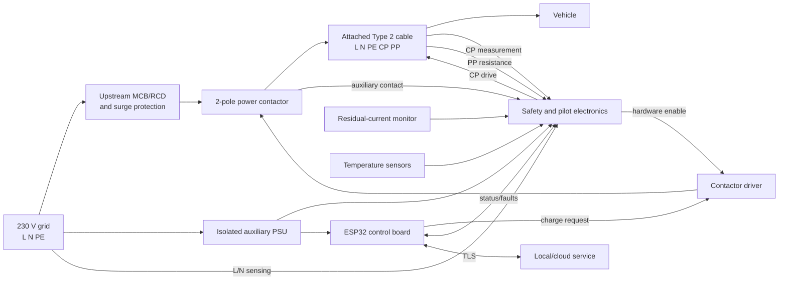
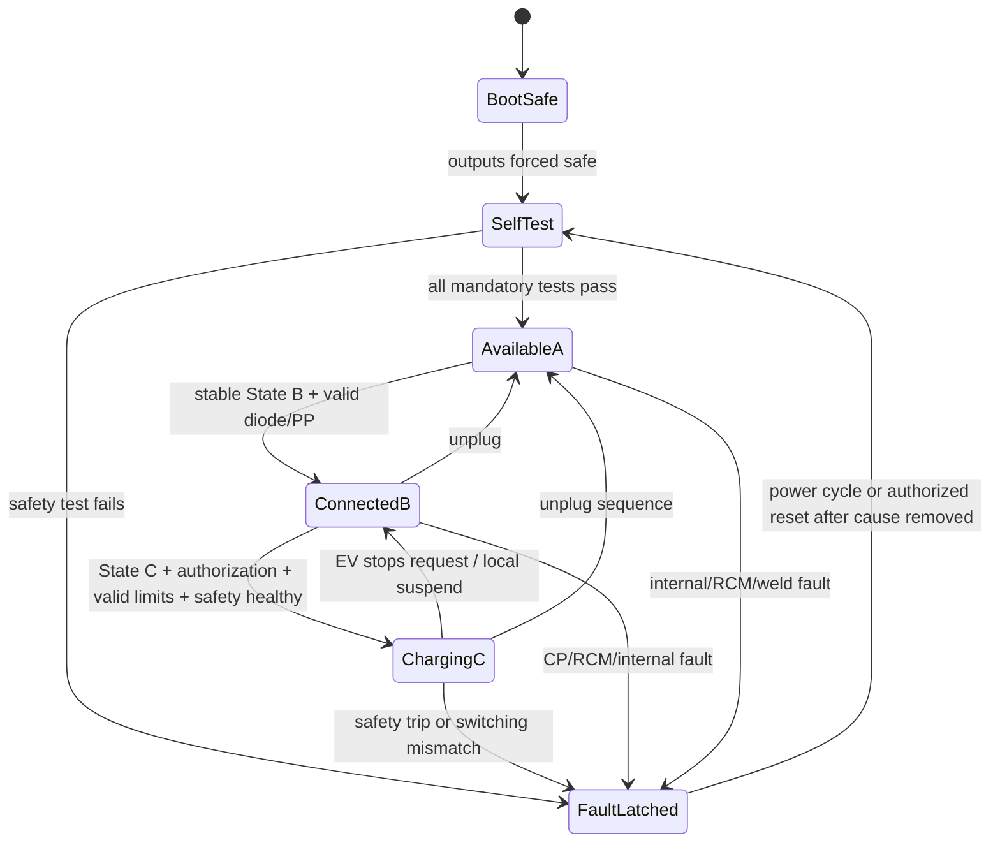

# EVSE system baseline — revision 0.1

## 1. Product definition

| Item | Baseline |
|---|---|
| Function | Conductive AC EV supply equipment, Mode 3 |
| Connection | Case C: attached cable and Type 2 vehicle connector |
| Supply | 230 V AC nominal, 50 Hz, L/N/PE |
| Output | 6–32 A configurable; 32 A / 7.4 kW rated |
| Controller | ESP32-S3-WROOM-1 family module running ESP-IDF |
| Network | 2.4 GHz Wi-Fi AP/STA; local web UI, NTP, MQTT |
| Installation | IP20 development configuration and IP65 outdoor-target configuration; wall or pedestal mounting |
| Environment | −25…+55 °C; up to 4000 m altitude |
| Thermal rating | 32 A under qualified conditions; automatic current derating permitted at high temperature/altitude |
| Charging authorization | Local enable initially; remote authorization later |
| Energy control | EVSE advertises maximum current; the vehicle controls actual draw |

The 32 A / 7.4 kW rating is confirmed. The branch circuit, contactor, cable, connector, terminals, PCB conductors, enclosure, and thermal design must all be coordinated with this rating and the applicable installation rules.

## 2. System boundary



The contactor driver uses a two-condition enable: a firmware request **and** a healthy safety chain. Any reset, brownout, watchdog trip, invalid CP condition, residual-current fault, or safety-supply failure removes coil energy.

## 3. External electrical interfaces

### 3.1 High-voltage and connector I/O

| ID | Signal | Direction | Nominal/range | Purpose | Required diagnostics | Safe state |
|---|---|---:|---|---|---|---|
| HV01 | AC_L_IN | Input | 230 V AC | Grid line | presence, RMS, over/undervoltage | isolated from output |
| HV02 | AC_N_IN | Input | neutral | Grid neutral | presence/plausibility | isolated from output |
| HV03 | PE_IN | Passive | protective earth | Protective bonding | continuity concept/TBD installation method | never switched |
| HV04 | AC_L_OUT | Output | 0 or 230 V AC, 32 A max | Vehicle power | voltage before/after switching | de-energized |
| HV05 | AC_N_OUT | Output | neutral, switched by 2-pole contactor | Vehicle return | voltage before/after switching | de-energized |
| HV06 | PE_OUT | Passive | protective earth | Vehicle protective conductor | continuity verification strategy | never switched |
| EV01 | CP | Bidirectional | ±12 V, 1 kHz pilot | connection state/current advertisement | high/low voltage, diode behavior, PWM feedback, short/open | State A/error; contactor open |
| EV02 | PP | Input | resistance to PE in plug/cable | cable current capability | ADC range/open/short/plausibility | conservative limit/no charge |
| EV03 | Cable temperature | Input | sensor-dependent | detect overheated plug/cable termination | open/short/rate/plausibility | derate then stop |

For an attached cable, PP identifies the cable assembly capability and is normally static. The advertised current must be the minimum of product rating, cable rating, site limit, thermal limit, and load-management limit.

### 3.2 Control and low-voltage I/O

| ID | Signal | Direction | Suggested interface | Use | Power-up default |
|---|---|---|---|---|
| CT01 | CP_PWM | Output | timer/PWM into isolated or protected ±12 V driver | 1 kHz current advertisement | disabled / steady +12 V |
| CT02 | CP_HIGH_ADC | Input | protected ADC/comparator | classify CP positive plateau | invalid until qualified |
| CT03 | CP_LOW_ADC | Input | protected ADC/comparator/sample timing | diode/negative plateau test | invalid until qualified |
| CT04 | PP_ADC | Input | protected resistance measurement | cable ampacity | no charge |
| CT05 | CONTACTOR_CMD | Output | GPIO through interlock logic | request coil energization | low |
| CT06 | CONTACTOR_AUX | Input | isolated auxiliary feedback | open/closed/weld detection | unknown/fault until read |
| CT07 | RCM_FAULT | Input | isolated, preferably latched | AC/DC residual-current trip | trip asserted until test passes |
| CT08 | RCM_TEST | Output | certified module test input | startup/periodic self-test | inactive |
| CT09 | LINE_SENSE_IN | Input | reinforced-isolated sensing | input supply present | unknown |
| CT10 | LINE_SENSE_OUT | Input | reinforced-isolated sensing | output/weld detection | unknown |
| CT11 | COIL_CURRENT | Input | ADC/comparator, optional | driver/coil plausibility | zero expected |
| CT12 | TEMP_POWER | Input | NTC/RTD front end | contactor/terminal temperature | invalid until sampled |
| CT13 | TEMP_PCB | Input | NTC/internal sensor | electronics temperature | invalid until sampled |
| CT14 | SERVICE_BUTTON | Input | debounced GPIO | commissioning/local stop | inactive |
| CT15 | STATUS_LED | Output | RGB driver | user state/fault indication | off or fault pattern |
| CT16 | UART_SERVICE | Bidirectional | isolated/service-only header | factory diagnostics | disabled in enclosure |

### 3.3 Communications and data

| Interface | Initial scope | Safety authority |
|---|---|---|
| Wi-Fi | provisioning, local status, configuration, logs, OTA | none; commands pass through local safety/state validation |
| HTTPS/MQTT | optional authenticated telemetry/control | none |
| NVS | limits, calibration, counters, fault history | corrupted data selects conservative defaults/no charge |
| OTA | dual-image update with rollback | update only while contactor is open; failure cannot energize output |

## 4. Protection and self-checking

### 4.1 Hardware protections

1. Upstream overcurrent protection sized for the installation and conductor rating.
2. Residual-current protection coordinated with local installation requirements. Use either appropriate Type B protection or Type A protection combined with an IEC 62955-compliant 6 mA DC residual-current detecting device, subject to the final conformity design.
3. Two-pole power contactor rated for the applicable utilization, fault level, endurance, temperature, and 32 A continuous current.
4. Contactor auxiliary feedback plus isolated output-voltage sensing to detect failure to open or close.
5. Protective-earth conductor is continuous and never switched. PE monitoring must not create a hazardous touch current or defeat installation protection.
6. Reinforced isolation/clearance/creepage between mains/pilot domains and user/network-accessible SELV electronics.
7. Coil suppression, surge protection, input filtering, fusing of auxiliary circuits, and thermal protection.
8. Hardware gating causes the contactor to drop out without relying on the main application task.

### 4.2 Startup test sequence

| Step | Test | Pass condition | Failure action |
|---:|---|---|---|
| 1 | Reset cause and watchdog | known reset source; counters valid | log; latch if repeated |
| 2 | Program/configuration integrity | valid application and configuration CRC/signature | inhibit charging |
| 3 | RAM/peripheral sanity | required peripherals initialize | inhibit charging |
| 4 | GPIO safe-state readback | contactor command low | inhibit/latch |
| 5 | Contactor-open confirmation | auxiliary=open and no unexpected output voltage | weld fault; latch |
| 6 | Input-supply check | voltage/frequency within configured limits | wait/inhibit |
| 7 | Residual-current monitor test | certified test completes in allowed time | latch fault |
| 8 | CP analog self-test | generated levels and measurement channels plausible | inhibit charging |
| 9 | PP and temperature plausibility | sensors in physical ranges | inhibit or conservative limit |
| 10 | Communications initialization | may fail without affecting safety | charge locally if policy permits |

### 4.3 Continuous diagnostics

- Sample CP synchronously and require stable classification with debounce/hysteresis.
- Compare commanded CP duty with measured duty and plateaus.
- Check the EV diode signature before energizing the contactor.
- Monitor residual current using a protection path with the required response independent of network operation.
- Compare contactor command, auxiliary contact, coil current, and output voltage.
- Monitor supply voltage, current, power, and temperature; apply warning, derating, then shutdown thresholds.
- Run task and hardware watchdogs; a missed deadline removes the hardware enable.
- Detect ADC stuck-at, open/short sensors, impossible combinations, excessive rates of change, and stale samples.
- Store the first fault cause, relevant measurements, state, and monotonic timestamp before later cascade faults overwrite context.

## 5. Charging control algorithm

### 5.1 Current-limit calculation

```text
I_advertised = min(
    I_product_rating,
    I_cable_PP,
    I_site_configuration,
    I_thermal_limit,
    I_load_management,
    I_user_or_backend_limit
)
```

If the result is below 6 A, suspend charging by using the standard pilot behavior rather than advertising a non-standard sub-6 A value. For the normal IEC 61851 PWM region, the commonly used relationship is `Imax = duty_percent × 0.6 A` from 10% through 85%; higher-duty behavior must be implemented from the licensed standard and validated during compliance testing.

### 5.2 CP state interpretation

The approximate nominal positive CP plateaus below are useful design targets, not production acceptance limits. Exact thresholds, tolerances, timing, and special states must come from the controlled edition of IEC 61851-1.

| State | Approx. positive CP | Meaning | Contactor |
|---|---:|---|---|
| A | +12 V | no vehicle | open |
| B | +9 V | vehicle connected, not requesting energy | open |
| C | +6 V | vehicle requests energy | may close after all checks |
| D | +3 V | vehicle requests energy with ventilation requirement | open unless ventilation is supported |
| E | 0 V | short/error | open, fault |
| F | −12 V | EVSE unavailable/error indication | open |

This prototype does not support forced ventilation, so State D shall not energize the contactor.

### 5.3 State machine



### 5.4 Closing sequence

1. Confirm stable State C, valid diode result, valid PP, authorization, and at least 6 A available.
2. Confirm RCM healthy, temperatures acceptable, input supply valid, contactor reported open, and output not unexpectedly energized.
3. Apply valid CP PWM for the computed current limit.
4. Assert the safety-chain enable and contactor request.
5. Within a bounded time, require auxiliary=closed and output voltage present; otherwise open and latch a switching fault.
6. Enter Charging only after feedback agrees. Continue every diagnostic while charging.

### 5.5 Opening sequence

1. Remove the contactor request immediately for a safety fault; use controlled suspension timing only for ordinary scheduling/load management where permitted.
2. Require auxiliary=open and output de-energized within bounded times.
3. A closed auxiliary or persistent output voltage is a welded-contactor fault: latch it, mark the connector hazardous, and do not automatically retry.
4. Return CP to the appropriate connected/available behavior only when safe.

## 6. Preliminary electronic architecture

Use separate schematic sheets/functional blocks:

1. **Mains entry:** L/N/PE terminals, fuse/MCB interface, surge suppression, EMI filter, isolated voltage sensing.
2. **Power switching:** 2-pole contactor, auxiliary contact, coil driver, hardware shutdown gate, output-voltage sensing.
3. **Residual-current protection:** certified RDC-DD/RCM module with fault and test interfaces.
4. **Control pilot/proximity pilot:** protected ±12 V CP source, 1 kHz PWM switching, high/low sampling, PP resistance input.
5. **Auxiliary power:** certified isolated AC/DC supply plus protected 12 V/5 V/3.3 V rails, brownout supervision.
6. **Controller:** ESP32 module, watchdog/supervisor, isolated sensing interfaces, service header, status UI.
7. **Metering/thermal:** isolated energy-metering IC or certified meter interface, current sensor, NTC inputs.

The original ESP32 can be used for the prototype, but select a current module revision that supports the required security features and has adequate lifecycle availability. Keep antenna clearance and high-current/mains circuitry far from the RF section.

## 7. Firmware architecture

| Component | Responsibility | Must not do |
|---|---|---|
| Safety supervisor | validate hardwired faults, watchdogs, contactor feedback; own final enable | depend on Wi-Fi |
| CP service | PWM generation, synchronized ADC capture, state/diode classification | close contactor directly |
| Charging state machine | legal transitions, authorization, start/stop sequencing | bypass safety supervisor |
| Limit manager | calculate minimum current constraint and PWM request | advertise above any constraint |
| Measurement service | filtered voltage/current/power/energy/temperature | make unvalidated safety decisions alone |
| Network service | provisioning, authenticated API, telemetry, time | directly write actuator GPIOs |
| Configuration service | schema, bounds, CRC/version migration | accept unsafe out-of-range limits |
| Fault recorder | first-fault snapshot and persistent event log | erase latched faults remotely without policy |
| Update manager | signed A/B OTA and rollback | update while output is energized |

Use ESP-IDF rather than an Arduino-only architecture for explicit task watchdogs, OTA rollback, secure storage, TLS, partition control, and production security options.

## 8. Fault classes

| Class | Examples | Recovery |
|---|---|---|
| Transient inhibit | no Wi-Fi when policy requires it, undervoltage, current allocation below 6 A | automatic after stable normal condition |
| Charge-session fault | CP invalid, overtemperature shutdown, contactor failed to close | unplug or explicit local reset after cause clears |
| Latched safety fault | residual current, welded contactor, safety-chain failure, corrupted safety configuration | de-energize; service/power-cycle policy after inspection |
| Permanent/service | repeated self-test failure, calibration invalid, incompatible hardware | service required |

Remote software may reduce current or stop charging. It may not clear welded-contactor, residual-current, PE-related, or internal safety faults without the defined local/service procedure.

## 9. Verification plan

Before connecting a vehicle, build a CP/PP simulator and isolated mains test fixture. Verify at minimum:

- every CP state, boundary, diode missing/reversed, CP short to PE, and noisy transitions;
- PP values, open/short, and advertised-current clamping;
- reset/brownout/watchdog at every state and during contactor transition;
- RCM startup test, injected AC/DC residual-current faults, and stuck fault/test lines;
- contactor fails to close, fails to open, welded contacts, missing auxiliary feedback, and false output sensing;
- over/undervoltage, sensor failures, overtemperature/derating, and current-limit changes;
- Wi-Fi loss, malformed commands, authentication failure, configuration corruption, OTA interruption, rollback;
- conducted/radiated emissions pre-compliance, EFT/burst, surge, ESD, insulation, dielectric strength, earth continuity, touch current, temperature rise, and abnormal operation.

No test that deliberately introduces a hazardous mains fault should be performed without a reviewed fixture, upstream protection, emergency isolation, and qualified personnel.

## 10. Standards register (to be confirmed for the exact EU market)

- IEC 61851-1:2017 plus Corrigendum 1:2023 — general requirements and Mode 3 control.
- IEC 62196-2 — Type 2 dimensional/interchangeability requirements.
- IEC 62955:2018 — residual DC detecting devices for Mode 3 EVSE.
- IEC 60364-7-722 — low-voltage installation requirements for EV supplies.
- IEC 61439-7 and/or the applicable product assembly standard, depending on construction and conformity route.
- IEC 61000 family and applicable product EMC standard(s).
- EU Low Voltage, EMC, Radio Equipment, RoHS, and other applicable legislation; determine harmonized standards and conformity route with a competent laboratory before freezing the design.

Standards must be purchased/accessed through an authorized source. This document intentionally does not substitute for their normative limits and test procedures.

## 11. Open decisions before schematic capture

1. RFID technology and credential policy.
2. Touch-display size, technology, and interface.
3. Phone application scope: responsive local web app/PWA or separately distributed native app.
4. Whether OCPP is required later; it is not part of revision 0.1.
5. Exact upstream MCB, Type A RCD, SPD, prospective fault current, and installation coordination assumptions.

The external C32 circuit breaker and Type A 40 A / 30 mA RCD are installation equipment, not EVSE schematic or BOM components.

## 12. Next engineering deliverables

1. Freeze the above decisions and create traceable system requirements.
2. Perform hazard analysis/FMEA and allocate each safety requirement to hardware, firmware, installation, or certified protection device.
3. Select the contactor, attached cable/plug, RCM/RDC-DD, power supply, metering method, and isolation components.
4. Calculate isolation coordination, thermal rise, conductor sizing, protection coordination, and switching endurance.
5. Capture schematics and simultaneously build the CP/PP low-voltage simulator.
6. Implement the firmware state machine against simulator tests before enabling mains switching.
