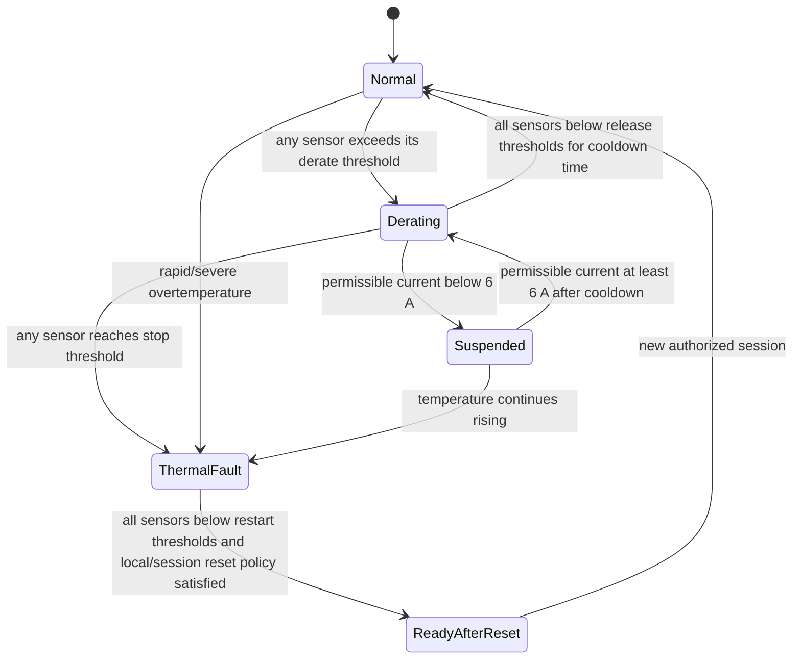

# Thermal derating algorithm — revision 0.1

## 1. Objective

The EVSE is rated up to 32 A, but automatic current reduction is permitted when temperature, installation, or altitude reduces safe continuous-current capability. The algorithm protects the cable terminations, contactor, power wiring, PCB, auxiliary supply, and enclosure while avoiding rapid current oscillation.

This document defines algorithm structure. Numerical temperature thresholds remain provisional until the selected components, sensor positions, enclosure, mounting configuration, and thermal-test results are available.

## 2. Required temperature channels

| Channel | Location | Purpose | Mandatory |
|---|---|---|---:|
| T1 | L input/output terminal or hottest power terminal | detect loose/high-resistance connection and conductor heating | yes |
| T2 | contactor body near the main contacts | protect contactor and estimate power-path heating | yes |
| T3 | control/power PCB hot region | protect PSU, drivers, metering, and controller | yes |
| T4 | internal enclosure air | estimate ambient-to-internal rise and improve derating stability | recommended |
| T5 | display/UI compartment | protect LCD/touch assembly in IP65 model | recommended |

The selected Type 2 plug has no embedded temperature sensor. Protection therefore depends on a qualified 32 A cable/plug assembly, correct PP coding, internal sensing, installation controls, and conservative thermal validation.

## 3. Sensor validation

Each channel has a raw value, filtered value, timestamp, validity state, and diagnostic flags. Before use, verify:

- ADC/reference and supply are within range;
- sensor is not open or shorted;
- value is inside the physically possible range;
- sample is fresh;
- rate of change is plausible, except where a real rapid thermal fault remains possible;
- related sensors are reasonably consistent without assuming they must be equal.

A mandatory invalid sensor inhibits a new session. During charging it initiates an immediate controlled stop, unless a separately justified independent hardware trip already guarantees a faster safe response. It shall not silently substitute a fixed 32 A allowance.

## 4. Per-sensor current envelope

Each sensor `i` produces a permissible current `Ithermal_i` from a validated, monotonic non-increasing curve:

```text
if T_i <= Tderate_start_i:
    Ithermal_i = 32 A

if Tderate_start_i < T_i < Tstop_i:
    Ithermal_i = interpolate(validated thermal curve for sensor i)

if T_i >= Tstop_i:
    Ithermal_i = 0 A and thermal shutdown
```

The combined thermal limit is:

```text
Ithermal = min(Ithermal_T1, Ithermal_T2, Ithermal_T3, ...)
```

The charge-current advertisement remains:

```text
Iadvertised = min(
    32 A product rating,
    cable PP rating,
    installation/site limit,
    Ithermal,
    load-management limit,
    user/backend limit
)
```

Never round upward. Quantize downward to the supported CP duty/current step after applying all limits.

## 5. Preliminary state behavior



Rules:

1. A required reduction is applied without waiting for the normal current-increase timer.
2. Current increases are slow and stepwise, and only after all relevant temperatures remain below their release thresholds for the configured cooldown time.
3. Use separate derate-entry and derate-release thresholds or equivalent hysteresis.
4. If `Ithermal < 6 A`, suspend: stop the energy-transfer sequence, open the contactor, and apply the applicable IEC 61851 pilot behavior. Do not advertise less than 6 A.
5. A stop-threshold crossing is a thermal session fault, not an ordinary load-management suspension.
6. Following thermal shutdown, automatic contactor reclosure within the same session is prohibited. Recovery requires cooldown plus the defined user/unplug/reset policy.
7. Network loss, NTP changes, display failure, or MQTT commands cannot disable derating.

## 6. Altitude treatment

Altitude is a product configuration/installation constraint, not a live sensor unless an appropriate pressure sensor is intentionally added. Validate thermal performance for the worst allowed 4000 m condition or derive a conservative altitude-dependent maximum-current table.

Possible implementation after testing:

```text
Iinstallation_max = min(Isite, Ialtitude_table, Ienclosure_variant, Imounting_variant)
```

The IP20/IP65 and wall/pedestal configurations may have different qualified limits. Configuration identifiers shall be fixed by manufacturing/service data and shall not be freely editable through MQTT or the normal user interface.

## 7. Provisional software timing policy

Exact values require test validation. Initial development values may be used only for simulator and bench work:

- thermal task period: 100–500 ms;
- mandatory sample stale timeout: no more than a few task periods;
- reduction confirmation: short filtering sufficient to reject ADC noise but not sustained heating;
- current increase: no faster than 1 A per defined multi-second interval;
- cooldown before increase: several minutes of stable temperature;
- restart after thermal shutdown: longer stable cooldown plus session reset.

These are architecture targets, not production safety values.

## 8. Thermal validation matrix

Test each relevant enclosure and mounting configuration at representative supply voltage and 6, 16, 25, and 32 A:

| Variable | Required coverage |
|---|---|
| Ambient | −25 °C startup, room temperature, elevated points through +55 °C |
| Altitude/cooling | 4000 m equivalent or justified correlated method |
| Enclosure | IP20 and sealed IP65 |
| Mounting | wall and pedestal |
| Solar load | include if outdoor installation permits direct sun |
| Supply | tolerance extremes relevant to coil, PSU, and dissipation |
| Faults | loose/high-resistance termination, blocked thermal path, sensor open/short/stuck |

Record temperatures at terminals, contactor contacts/body, cable entry, conductors, PCB hot spots, PSU, RDC-DD, display, enclosure surface, and each installed sensor. Derive thresholds from the lowest applicable component/material limit with measurement error, production tolerance, aging, and safety margin.

## 9. Acceptance criteria

- No monitored or unmonitored safety-relevant component exceeds its justified limit.
- Advertised-current reduction matches the calculated minimum limit and never increases during worsening temperature.
- The vehicle-facing CP update remains standards-compliant.
- Below 6 A permissible current, the contactor opens and the EVSE suspends safely.
- Every sensor fault produces the specified inhibit/stop response.
- No oscillation occurs around derating thresholds.
- Recovery cannot bypass cooldown, fault policy, or the safety supervisor.

